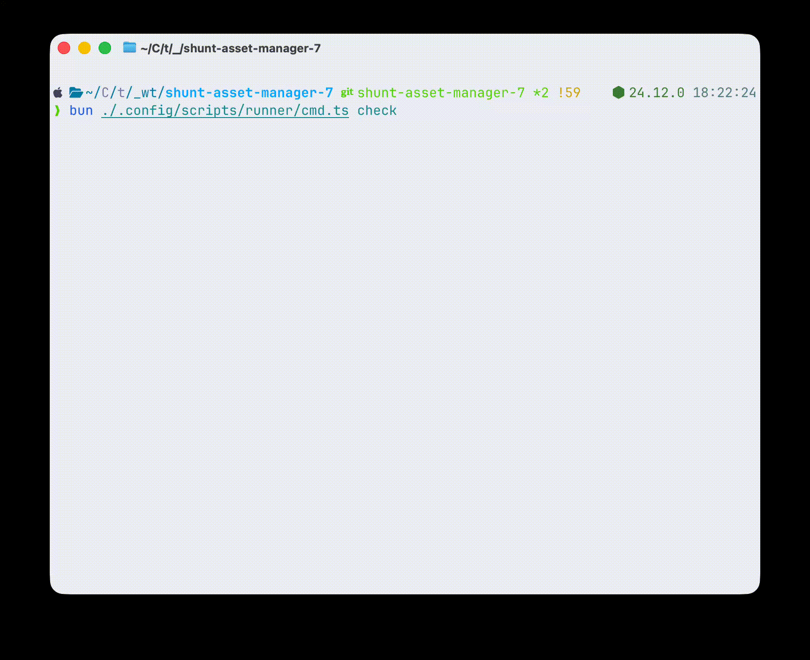

<p align="center">
  <h1 align="center">OpenTurbo(WIP)</h1>
  <p align="center">
    <strong>TurboRepo-style task runner for Bun</strong>
    <br />
    <em>Lightweight, zero-dependency task runner with Git worktree awareness</em>
  </p>
</p>

<p align="center">
  <a href="#features">Features</a> •
  <a href="#usage">Usage</a> •
  <a href="#configuration">Configuration</a> •
  <a href="#worktree-management">Worktree Management</a> •
  <a href="#step-types">Step Types</a> •
  <a href="#branch-filtering">Branch Filtering</a>
</p>

`OpenTurbo` is a high-performance task runner designed for Bun. It brings TurboRepo-style parallel execution and dependency graph awareness to any project, with first-class support for Git worktrees and branch-conditional tasks.

---


## Features

- **Worktree Management**: Full lifecycle management (add, remove, list) with support for post-creation hooks
- **Branch-filtered steps**: Run steps conditionally based on branch patterns with glob and negation support
- **Git worktree support**: Copy files between worktrees, branch-specific filtering for worktree contexts
- **Workspace-aware execution**: Parallel NPM script execution across npm/bun workspaces with dependency ordering
- **Dependency graph**: Define step dependencies with `dependsOn` for sequential or parallel execution

## Installation

Currently, you can install OpenTurbo from source using `bun add`:

```sh
bun add -D github:shuntksh/openturbo
```

## Usage

```sh
ot <job-name> [options]
```

### Options

| Flag | Description |
|------|-------------|
| `-j, --job <name>` | Job name to run (can also be positional) |
| `-c, --config <path>` | Custom config file path |
| `--graph` | Print execution graph without running |
| `--fail-fast` | Stop on first failure (default: true) |
| `-v, --verbose` | Show command output |
| `--no-color` | Disable colored output |
| `-h, --help` | Show help |

### Worktree Management

```sh
ot wt <command> [options]
```

| Command | Description |
|---------|-------------|
| `add` | Create a new worktree (and optionally a new branch) |
| `remove` | Remove a worktree (and optionally delete its branch) |
| `list` | List managed worktrees |


## Configuration

Config is discovered from (in order):

1. Custom path via `--config`
2. `workflow.json` or `workflow.jsonc` in git root
3. `.config/workflow.json` or `.config/workflow.jsonc`
4. `workflows` field in `package.json`

### Example

```jsonc - package.json
{
  "workflows": {
    "build": {
      "steps": [
        { "name": "install", "cmd": "bun install --frozen-lockfile" },
        { "name": "build", "bun": { "script": "build" }, "dependsOn": ["install"] }
      ]
    },
    "sync-config": {
      "steps": [
        {
          "name": "copy-from-main",
          "branches": ["worktree:*", "!main"],
          "worktree:cp": {
            "from": "worktree:main",
            "files": [".config/settings..json",".env"],
            "allowMissing": true
          }
        }
      ]
    },
    "test-all": {
      "steps": [
        {
          "name": "test",
          "bun": {
            "script": "test",
            "dependsOn": ["^build"],
            "timeout": 60000
          }
        }
      ]
    }
  }
}
```

### Worktree Configuration

Configure worktree defaults and hooks in the `worktree` section of your config:

```jsonc
{
  "worktree": {
    "defaults": {
      "base_dir": "../worktrees" // Relative to git root
    },
    "hooks": {
      "post_create": [
        {
          "type": "copy",
          "from": ".env",
          "to": ".env"
        },
        {
          "type": "command",
          "command": "bun install"
        }
      ]
    }
  }
}
```

## Worktree Management

OpenTurbo replaces `git worktree` boilerplate with a streamlined CLI that handles directory management and setup hooks.

### Commands

**List worktrees**
```bash
ot wt list
```

**Add a worktree**
```bash
# Add worktree for existing branch
ot wt add feature/login

# Create new branch and worktree
ot wt add -b feature/new-ui

# Add with custom base
ot wt add -b fix/bug --base v1.2.0
```

**Remove a worktree**
```bash
# Remove worktree directory only
ot wt remove feature/login

# Remove worktree and delete the branch
ot wt remove --with-branch feature/login
```


## Step Types

### `cmd`

Run a shell command:

```json
{ "name": "build", "cmd": "bun run build" }
```

### `worktree:cp`

Copy files from another worktree:

```json
{
  "name": "sync",
  "worktree:cp": {
    "from": "main",
    "files": ["config.json", "secrets/"],
    "allowMissing": true
  }
}
```

### `bun`

Run scripts across workspace packages with dependency ordering (TurboRepo-style):

```json
{
  "name": "test",
  "bun": {
    "script": "test",
    "dependsOn": ["^build"],
    "timeout": 30000
  }
}
```

**Dependency syntax:**
- `^task` — Run task in all dependencies first
- `task` — Run task in current package first
- `pkg#task` — Run specific package's task first

## Branch Filtering

Steps can be filtered by branch using glob patterns:

```json
{ "name": "deploy", "branches": ["main", "release-*"] }
```

**Pattern syntax:**
- `*` — Matches any characters
- `!pattern` — Negation (exclude matching branches)
- `worktree:*` — Only run in worktree contexts

## License

MIT
